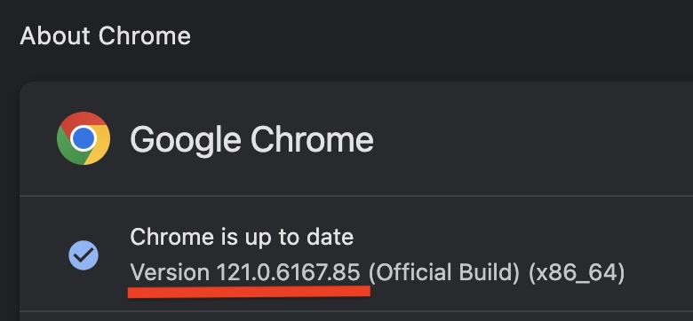

# GSUR

---
# Installation

Frameworks
Python 3
Webdrivers are required to run automated browser software 

    - Browser: Google Chrome
    - How to check your chrome browser version
            - Open a new tab in Chrome
            - Click the three dot button in the top right
            - Click the "Help" button that is second from the bottom
            - Click "About Google Chrome" 
            - The tab will reload and you should be able to see your browser version number listed and the option to update the browser if you have not
            

    - [Webdriver Download](https://googlechromelabs.github.io/chrome-for-testing/ "Chrome Webdriver")
    - NOTE: If the Lastest version of chrome doesn't have stable webdrivers but you can download previous chrome browser versions along with their drivers that are certified to work from the site above. As long as the browser and webdriver version match everything will work.
    - How to install:
       1. 
        - Need Help?  
            - MacOS: https://www.youtube.com/watch?v=m4-Z5KqDHpU
            - Windows: NA


- ***(OPTIONAL)*** Create a virtual environment if you choose to do so
    - In the /GSUR folder
    - `python -m venv myenv`
    - On Windows `myenv/Scripts/activate`
    - On macOS and Linux `source myenv/bin/activate`
- ***(OPTIONAL)*** Managing the virtual environment
    - When you want to leave use `deactivate`
    - Make sure to upgrade pip `python -m pip install --upgrade pip`
- Install packages from requirements.txt before running the Living Atlas
    - `pip install -r requirements.txt`
- For logging into the site you have to have your username and password setup for the automation to use
    - Create a new file `.env` in the same directory as the chrome_automation.py file and have it contain this:
        ```
        USERNAME = "your_username"
        PASSWORD = "your_password"
        ```


### To Run the GSUR Web Automation
- In 1st terminal navigate to the /GSUR folder 
    - Use `python3 chrome-automation.py` to run the chrome code
