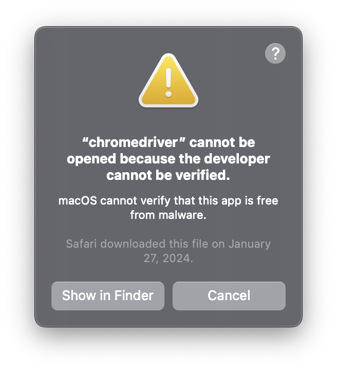

<div align="center">
<h1 align="center">GSUR Data Automation Tool</h1>
Automate the Process of Downloading and Analyzing Patient Data 

</div>

---
- [About](#about)
- [Features](#features)
- [Installation & Setup](#installation--setup)
- [How to Run the Code](#to-run-the-gsur-web-automation)
- [Learn More](#learn-more)

---
## About
The GSUR Data Automation Tool has two features. An automated downloader tool that runs off of selenium to open your browser and login into the patient portal website and downloads all necessary files, and the analysis tool that reads through all the data files and outputs the result into a single .csv file.


## Features
- Python 3
- Browser Automation to Download Data 
- Automation to Analyze Data and Output Results to Singular CSV file. 
> [!NOTE]
> Webdrivers are required to run automated browser software. 
> Only Google Chrome is supported at the moment

## Installation & Setup
1. Ensure you have Python3 installed and download the codebase to your local machine.

2. Download External Python Libraries
    ```bash
    pip install -r requirements.txt
    ```

3. Setup Login Credentials
- For logging into the EMMA site you have to have your username and password setup in a seperate file for the automation to pull from.
- Create a new file `.env` in the same directory as the chrome_automation.py file and have it contain this:
    ```
    USERNAME = "your_username"
    PASSWORD = "your_password"
    ```

4. Install Browser Webdrivers

- Webdrivers are specific for each web browser and must be installed by the user for this software to download files properly.
Supported Browsers: Google Chrome

<u>Find out what the version number is for your browser.</u>
- Open a new tab in Chrome
- Click the three dot button in the top right
- Click the "Help" button that is second from the bottom
- Click "About Google Chrome" 
- The tab will reload and you should be able to see your browser version number listed and the option to update the browser if you have not


^^^ Remember your Version Number
> [!NOTE]
> Your Browser will most likely have a different number than what is shown above.

<u>Download your specific webdriver version.</u>

Webdrivers for Google Chrome
- [Chrome Webdriver Download Page](https://googlechromelabs.github.io/chrome-for-testing/ "Chrome Webdriver")
- If the version of your chrome doesn't have stable webdrivers released yet (your version number will be colored red instead of green). You can download previous stable chrome browser versions along with their drivers that are certified to work from the site above. As long as the browser and webdriver version match everything will work.

<u>Move Webdriver to Correct Place.</u>
- MacOS
    -  Once the Chrome webdriver is downloaded, on MacOS extract the folder. 
    - You will need to move the _chromedriver.exe_ to your _/usr/local/bin_ folder. You can easily go to this folder by holding CMD+SHIFT+G in Finder and once the _/bin_ dialog box appears press enter.
    - Once in the _/bin_ folder move the _chromedriver.exe_ to this.
    - Need Help? [Installing Chrome Driver Web Driver on Mac](https://www.youtube.com/watch?v=m4-Z5KqDHpU "Installing Chrome Driver Web Driver on Mac")

- Windows
    - TBD

<u>Verify Webdriver Installation and Permissions</u>
- MacOS
    - After pasting the _chromedriver.exe_ into the _/bin_ folder if you get this dialog box at any point, here's how you can solve it.

    - Open a terminal window at _/usr/local/bin_ using the method above and enter
    ```bash
    ls -l
    ```
    - If the chromedriver file has an @ symbol at the end of the permissions for example, -rwxr-xr-x@
    - Use this command to remove this file from MacOS quarentine.
    ```bash
    xattr -d com.apple.quarantine chromedriver
    ```
    - This website goes into more detail on how to solve this issue [Chromedriver Error Help Webpage](https://dev.to/ruthmoog/dealing-with-error-chromedriver-cannot-be-opened-because-the-developer-cannot-be-verified-1897 "Chromedriver Error")

- Windoows
    - TBD

## To Run the GSUR Web Automation
- In terminal or code editor navigate to the /GSUR folder. Ensure you have the webdrivers installed, requirements.txt downloaded, and credentials .env created.
    - Use `python3 chrome-automation.py` to run the downloader code
    - Use `python3 djcbarmaker.py` to run the analysis code


## Learn More
This software was built by Mitchell Kolb for use in the Psychology Department at WSU GSUR Program.


---
#### This is optional step you can take before the installation & setup section to help keep this project libraries seperate
- ***(OPTIONAL)*** Create a virtual environment if you choose to do so
    - In the /GSUR folder
    - `python -m venv myenv`
    - On Windows `myenv/Scripts/activate`
    - On macOS and Linux `source myenv/bin/activate`
- ***(OPTIONAL)*** Managing the virtual environment
    - When you want to leave use `deactivate`
    - Make sure to upgrade pip `python -m pip install --upgrade pip`
---
